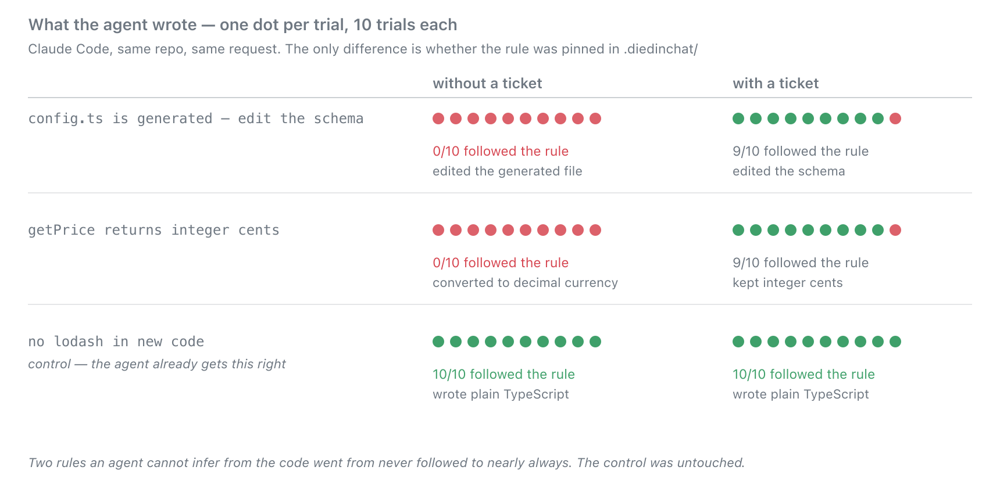
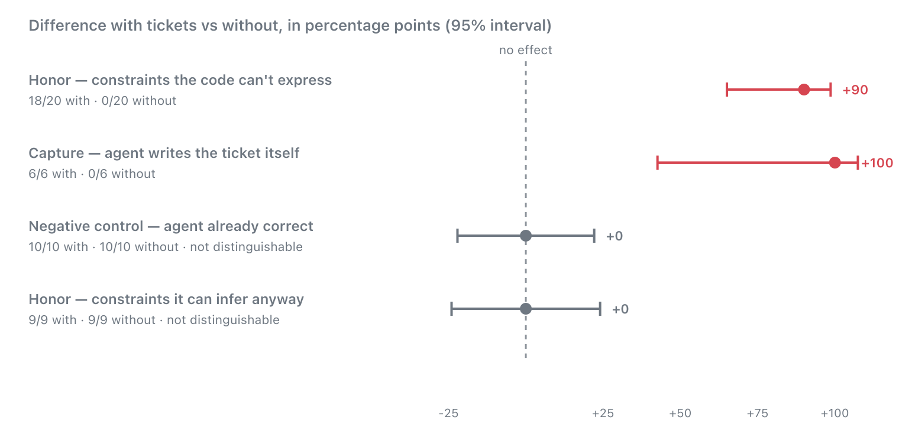
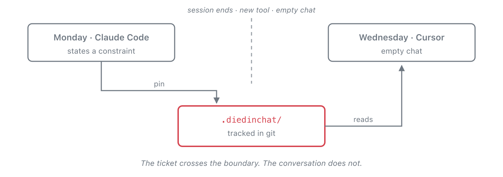

<p align="center">
  
</p>

<h1 align="center">diedinchat</h1>

<p align="center"><strong>You told it the rule. Then the chat ended.</strong></p>

<p align="center">
  <a href="https://www.npmjs.com/package/diedinchat"></a>
  <a href="LICENSE"></a>
  <a href="package.json"></a>
  <a href="https://github.com/pawankumar94/diedinchat/actions"></a>
</p>

<p align="center">
  <strong>0/10 → 9/10 rule compliance · 117 measured invocations · no model in the check · one JSON file per rule</strong>
</p>

---

## Before / after

Your `src/config.ts` is generated from a schema. Nothing in the file says so.
You ask any coding agent to change the API base URL.

**Without diedinchat** — it edits the generated file. The next build silently
throws your change away:

```ts
// src/config.ts        ← generated. edited anyway.
export const config = {
  apiBase: "https://api.acme.production",   // gone on next build
};
```

**With the rule pinned** — it edits the source and leaves the generated file
alone:

```ts
// src/config.schema.ts ← edited here
  apiBase: "https://api.acme.production",

// src/config.ts        ← untouched
  apiBase: "https://api.acme.test",
```

Same repo, same request, same agent. The only difference is one file:

```json
{
  "text": "src/config.ts is generated from the schema. Never edit it directly.",
  "files": ["src/config.ts", "src/config.schema.ts"],
  "evidence": ["ConfigSchema"],
  "status": "supported"
}
```

Both snippets are verbatim from
[the measured run](docs/evidence/honor-invisible-v2-results.json).

## The numbers

Three rules a coding agent cannot read from the code. Ten trials each, with and
without the rule pinned.

<p align="center">
  
</p>

**18/20 versus 0/20.** +90 points, 95% interval +65 to +99.

The third row is a control, fixed before the run: a rule the agent already
follows. It scored 10/10 in **both** arms. Tickets moved the two things that
were broken and left the working one alone — which is the part that makes the
other two rows worth believing.

<p align="center">
  
</p>

Four experiments, 117 invocations, every raw record committed and re-runnable.
Two exclude zero; two are nulls published anyway. Method, failures and data:
[docs/evidence/](docs/evidence/).

## Install

```bash
npx diedinchat install
```

Writes the convention into the file your agent already reads — no server, no
config edit, no account:

| | |
|---|---|
|  Claude Code | `.claude/skills/diedinchat/SKILL.md` |
|  Cursor | `.cursor/rules/diedinchat.mdc` |
|  Copilot | `.github/instructions/diedinchat.instructions.md` |
|  Windsurf | `.windsurf/rules/diedinchat.md` |
|  Cline | `.clinerules/diedinchat.md` |
|  Gemini | `AGENTS.md`, `skills/…` |
| anything else | `AGENTS.md` |

Then pin a rule — or just say it in chat and let the agent pin it for you
(measured: 6/6 with the convention installed, 0/6 without):

```bash
diedinchat pin --text "src/config.ts is generated. Edit the schema." \
  --file src/config.ts --file src/config.schema.ts \
  --evidence ConfigSchema
```

```bash
diedinchat status src/config.ts     # what rules cover this path
diedinchat check --json             # for CI
diedinchat install-hook --hook pre-commit
```

## How it works

One JSON file per rule in `.diedinchat/`, committed next to your code. `files`
is the address. `evidence` is a phrase that must stay true.

**Status is recomputed from disk on every read. No model is involved.**

| | |
|---|---|
| `supported` | the evidence still holds |
| `contradicted` | the evidence is gone — red, the way a test goes red |
| `stale` | files moved and nothing was frozen to check against |
| `open` | pinned, nothing to verify yet |

That last property is what a rules file cannot do. `.cursorrules` saying *"auth
is in middleware"* keeps saying it after someone deletes middleware. A ticket
re-checks itself and goes red.

<p align="center">
  
</p>

## FAQ

**How is this different from `.cursorrules` or agent memory?**
Three ways. A rule in `.cursorrules` is about the whole repo, so it is either
always in context — costing tokens every turn — or absent when it matters. It
never expires, so it recites facts that stopped being true. And it does not
travel: Cursor's memory is not Claude Code's. A ticket is addressed to paths,
re-checks itself, and is a file in your repo.

**Why not just write a test?**
Tests lock behaviour. "This file is generated" is not behaviour — both versions
return the same thing and both go green.

**What should I pin?**
Things the code cannot tell an agent: a generated file, a library that is
installed but banned, a value that is cents behind a `number` type. Pinning
things the code already demonstrates does nothing — we
[measured that](docs/evidence/honor-rate.md) and got 9/9 in both arms.

**What if the agent just ignores it?**
Sometimes it does — at 90%, roughly one invocation in ten still misses. Two
answers, in increasing strength:

```bash
diedinchat install-agent-hook     # Claude Code: gate the write itself
diedinchat install-hook --hook pre-commit   # works regardless of editor
```

The agent hook runs *before* an edit: it puts the rules covering that file in
front of the model, and denies the write outright when one is contradicted.
That closes the exact failure we measured — an agent editing a generated file
having never looked. The git hook is the floor under everything, including a
human editing by hand.

Gating needs a host that exposes a pre-write hook. Claude Code and Cursor do;
Copilot's path-scoped instructions are advisory only. Nothing can gate what
exposes no gate, so git and CI stay the editor-independent backstop.

**What does it cost?**
Tokens. In the measured runs, tickets in the workspace raised mean cost per
invocation from $0.026 to $0.045 and median latency from 22s to 31s. The agent
reads them and runs `status`. On short tasks that is a large fraction of a small
number.

**Does it work with my agent?**
`install` writes to nine targets and the store is plain files, so anything that
reads your repo can use it. But every number above is Claude Code on
`claude-sonnet-4-6` — Copilot, Cursor and Gemini are untested, and that is the
next measurement.

**Can I reproduce your numbers?**
Yes, that is the point.

```bash
diedinchat run --tasks examples/honor-invisible/tasks-v2.json \
  --agent examples/honor-rate/claude-code.json \
  --policy no-tickets --policy with-tickets --trials 10
diedinchat score --tasks examples/honor-invisible/tasks-v2.json
diedinchat report --baseline no-tickets --candidate with-tickets
```

## Docs

| | |
|---|---|
| [how-it-works.md](docs/how-it-works.md) | the handoff, status derivation, what is actually guaranteed |
| [docs/evidence/](docs/evidence/) | every experiment, its design, and its raw records |
| [integrations.md](docs/integrations.md) | per-client MCP setup |
| [PLANNER.md](PLANNER.md) | what is left to build |

```bash
npm test        # 143 tests, no network or agent CLI required
```

Releases publish from GitHub Actions with npm provenance, so the registry
attests which commit built the tarball.

MIT.
