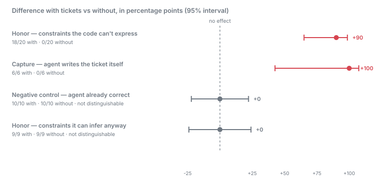
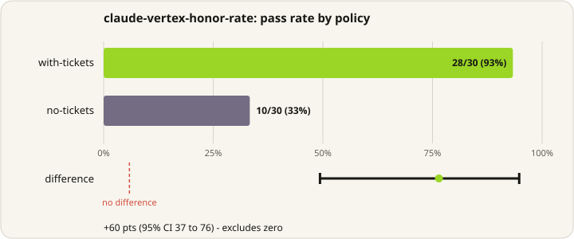

<p align="center">
  
</p>

<h1 align="center">diedinchat</h1>

<p align="center"><strong>Your agent agreed to a rule. Then the chat ended, and the rule went with it.</strong><br>diedinchat pins that rule to the files it was about, in git, where the next agent will find it — and tells you when it stops being true.</p>

<p align="center">
  <a href="https://www.npmjs.com/package/diedinchat"></a>
  <a href="LICENSE"></a>
  <a href="package.json"></a>
  <a href="https://github.com/pawankumar94/diedinchat/actions"></a>
</p>

---

## The problem

Monday, you tell Claude Code:

> Auth only goes through `src/middleware.ts`. Don't call `requireUser()` in route handlers.

It agrees. It even refactors a handler to match.

**That sentence now exists in exactly one place: Monday's chat log.** Not in the
repo. Not in a test. Not in CODEOWNERS. Nowhere a machine will ever look again.

Wednesday, you open the same commit in Cursor. Empty chat. You ask for a new
`/admin` route:

```ts
export function admin(req) {
  requireUser(req);        // the rule nobody could see
  return renderAdmin();
}
```

`git diff` shows a perfectly normal new file. Tests pass — they never encoded
"auth lives in one file." Review is where you catch it, if you catch it.

The model wasn't careless. **The constraint was never attached to the files it
was about,** so no later agent could have seen it. Same story, different rules:

| Someone said, in chat | About | What happens next session |
|---|---|---|
| "Don't put SQL in route handlers, only `src/db/`." | `src/db/`, `src/routes/` | An agent inlines a query in a new route |
| "`config.ts` is generated. Edit `config.schema.ts`." | both files | An agent "fixes" the generated file; the next build overwrites it |
| "All prices are integer cents." | `src/money.ts`, `src/billing/` | An agent writes `price * 1.1` in a billing helper |

## Why nothing you already have fixes this

Your repo has four mechanisms for encoding truth, and this falls through all of them.

**Git records changes, not commitments.** It will tell you `admin.ts` was added.
It cannot tell you that adding it broke a promise, because the promise was never
a git object. Git has no type for a sentence about a file.

**Tests lock behaviour, and this isn't behaviour.** "Auth lives in one file" is
structural. Both implementations return the same thing for the same input, so
both go green. You'd have to write a grep-shaped test and remember to keep it.

**CODEOWNERS locks who may touch a path**, and says nothing about what is true of it.

**Agent memory and rules files fight the wrong problem.** `.cursorrules`,
`AGENTS.md`, stored memories, "summarise the last chat" — all of them try to
push *more text* into the next context window. Three things go wrong:

- **They aren't addressed to paths.** A rule in `.cursorrules` is about the
  whole repo or nothing. It cannot fire *because you touched `src/routes/`*, so
  it's either always loaded — diluting the window and costing tokens on every
  turn — or not there when it matters.
- **They never expire.** A memory saying "auth is in middleware" keeps saying it
  after someone refactors `middleware.ts` out of existence. It states a dead
  fact with full confidence, which is worse than saying nothing.
- **They don't travel.** Cursor's memory is not Claude Code's memory. Switch
  tools, or switch machines, and you start over.

There is no object in a repository that means *"this sentence about these files
must stay true."* That is the gap.

## What diedinchat does

One JSON file per constraint, in `.diedinchat/`, committed next to your code.

```json
{
  "id": "auth-surface",
  "text": "Auth only goes through src/middleware.ts.",
  "files": ["src/middleware.ts", "src/routes/"],
  "evidence": ["withAuth"],
  "hashes": { "src/middleware.ts": "sha256…" },
  "status": "supported"
}
```

Three properties follow from that, and they're what the alternatives lack:

**It's addressed to paths.** `diedinchat status src/routes/` returns the two
tickets about that directory and nothing else. An agent about to edit a file
asks a question scoped to that file, instead of carrying every rule you've ever
written in its context.

**It expires.** Freeze a phrase that must stay true — `withAuth`, say — and
every read re-checks it against the files. When it stops holding, the ticket
goes `contradicted` on its own, with nothing to run and no model to ask. This is
the part no memory system does: **the claim knows when it stopped being true.**

**It travels.** It's a file in your repo. Cursor, Claude Code, Codex, Copilot,
a teammate, CI — same tickets, because they live next to the code rather than
inside one vendor's session store.

<p align="center">
  
</p>

### Four states, computed from disk

No model is involved in deciding these. It's file hashes and string matching, so
the answer is reproducible and auditable.

| Status | Means |
|---|---|
| `open` | Pinned, but nothing frozen to check it against |
| `supported` | The frozen evidence still holds |
| `contradicted` | The evidence is gone. Red, the way a test goes red. |
| `stale` | A pinned file changed and there was no evidence to check — re-check it by hand |

`contradicted` is the state that matters. Git tells you a file changed; this
tells you a *promise about it* stopped being true — which is why a ticket
doesn't rot into confident misinformation the way a stored memory does.

Freeze evidence when you pin, and the ticket checks itself. Pin without it and
all you get is `stale` on any edit, which on real history fired on
[65% of commits](docs/evidence/stale-noise.md) — noise, not signal.

## Quickstart

```bash
npx diedinchat pin --text "Auth only goes through src/middleware.ts. Never check auth in a route handler." \
  --file src/middleware.ts --file src/routes/ \
  --evidence withAuth      # a phrase that must stay true; this is what makes it self-checking

npx diedinchat install     # teach every agent in this repo to read tickets first
```

```bash
npx diedinchat status src/routes/
```

```text
supported  auth-only-goes-through-src-middleware-ts
           Auth only goes through src/middleware.ts. Never check auth in a route handler.
           files: src/middleware.ts, src/routes
```

| Command | |
|---|---|
| `diedinchat` | status of every ticket (the default; local and free) |
| `diedinchat status <path>` | only tickets covering that path |
| `diedinchat status --json` | machine-readable, for CI |
| `diedinchat pin --text … --file …` | pin a constraint |
| `diedinchat check` | re-evaluate against current files |
| `diedinchat close <id>` / `unpin <id>` | retire it, or delete it |

## Works with the agent you already use

`install` writes the convention into the file each agent already loads — no
server, no config edit:

| Agent | File written |
|---|---|
|  Claude Code | `.claude/skills/diedinchat/SKILL.md` |
|  Cursor | `.cursor/rules/diedinchat.mdc` |
|  GitHub Copilot | `.github/instructions/diedinchat.instructions.md` |
|  Windsurf | `.windsurf/rules/diedinchat.md` |
|  Cline | `.clinerules/diedinchat.md` |
|  Gemini / Antigravity | `AGENTS.md`, `skills/…` |
| Any agent | `AGENTS.md`, in a fenced block |

**Over MCP**, for clients that prefer tools to files:

```bash
diedinchat mcp     # pin_claim · list_claims_for_file · check_claim
```

**As a git hook**, when you'd rather not depend on an agent remembering:

```bash
diedinchat install-hook --hook pre-commit
```

That last one is the only path that holds no matter what the agent does. Setup
per client is in [docs/integrations.md](docs/integrations.md).

## Does it actually work?

Four experiments, 117 agent invocations, every raw record committed. Two results
exclude zero; two deliberately do not.

<p align="center">
  
</p>

**Yes — on constraints your code cannot express.** Claude Sonnet 4.6, three
constraints an agent cannot infer, 60 invocations, zero harness errors:

| | Constraint honored |
|---|---|
| ticket pinned | **18/20 (90%)** |
| no ticket | **0/20 (0%)** |

**+90 points, 95% interval +65 to +99.** Unaided, the agent edited a generated
file on every single trial — a change the next build silently discards — and
converted a cents value to decimal currency on every pricing trial. With the
constraint pinned, it stopped.

<p align="center">
  
</p>

**And a negative control, specified before the run.** A third constraint the
agent already gets right unaided scored 10/10 in *both* arms — +0 points,
interval −22 to +22. Tickets moved the two things that were broken and left the
working one alone. Full design, both remaining failures, and all 60 raw records:
[docs/evidence/honor-invisible.md](docs/evidence/honor-invisible.md).

**What it costs.** Tickets are not free: across the same 60 invocations, having
them in the workspace raised mean cost per invocation from **$0.026 to $0.045
(+72%)** and median latency from 22s to 31s. The agent reads the tickets and
runs `status`, and that is real spend. On these short tasks the overhead is a
large fraction of a small number; on longer work it amortises. Measure it on
your own repo before pinning hundreds.

**Agents also write the tickets themselves.** With the convention installed,
constraints stated in passing were pinned 6/6; without it, 0/6. +100 points,
interval +43 to +107. [docs/evidence/capture-rate.md](docs/evidence/capture-rate.md).

### What to pin

Tickets do not make a model better at what it already does well — a separate run
found **no effect at all** for constraints inferable from surrounding code, 9/9
in every arm. Pin what the code cannot tell it:

| Worth pinning | Not worth pinning |
|---|---|
| "`config.ts` is generated — edit the schema" | "handlers use `withAuth`" (the other handlers show it) |
| "don't use lodash, it's installed but banned" | "SQL lives in `src/db/`" (`src/db/` is right there) |
| "this returns cents despite the `number` type" | anything the code already demonstrates |

That null is measured too: [docs/evidence/honor-rate.md](docs/evidence/honor-rate.md).

**One more.** `stale` used to fire on 65% of commits for a file-pinned ticket and
97% for a directory-pinned one. Frozen evidence now decides the outcome: 0%
false alarms, still catching 11/11 injected breakages.
[docs/evidence/stale-noise.md](docs/evidence/stale-noise.md).

## Status

Usable today for pinning, reading, and checking constraints. This repo uses it
on itself; all four of its tickets are `supported`, and CI fails if one breaks.

Known gaps, in the order they will bite you:

- **A ticket pinned without evidence still goes `stale` on any edit** to its
  paths. `pin` should require evidence, or generate it; today it is an optional
  flag most people will skip.
- **`--file` takes literal paths and directories only** — no globs, and
  directory expansion ignores `.gitignore`.
- **MCP lags the CLI**: `close` and `unpin` aren't exposed, so an MCP-only agent
  can create tickets it can't retire.
- **A ticket is not a guarantee.** At 90%, roughly one invocation in ten still
  misses. `install-hook` is the path that does not depend on the agent looking.
- **One agent, one model.** Everything measured so far is Claude Sonnet 4.6.
  Copilot, Gemini and cheaper tiers are untested.

## Documentation

| Doc | Covers |
|---|---|
| [docs/how-it-works.md](docs/how-it-works.md) | The handoff, status derivation, and what is actually guaranteed |
| [docs/integrations.md](docs/integrations.md) | Per-client MCP setup, library usage |
| [docs/evidence/honor-rate.md](docs/evidence/honor-rate.md) | The published result, its design, and its limits |
| [docs/lab.md](docs/lab.md) | The measurement harness used to test claims like the one above |
| [PLANNER.md](PLANNER.md) | What is left to build |
| [AGENTS.md](AGENTS.md) | Entry point for agents working in this repo |

## Development

```bash
npm install
npm test        # 143 tests, no network or agent CLI required
npm run build
npm run typecheck
```

Releases publish from GitHub Actions with npm provenance, so the registry
attests which commit and workflow produced the tarball.

## License

MIT. See [LICENSE](LICENSE).
