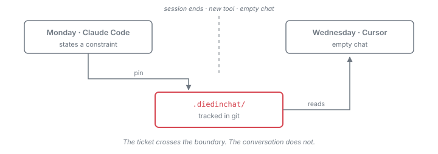
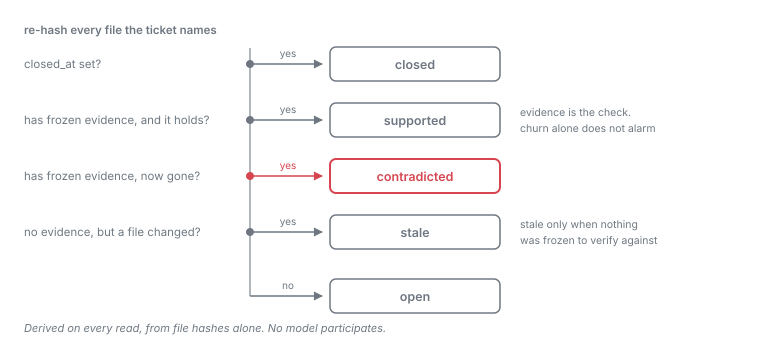
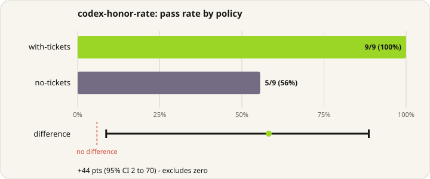

<p align="center">
  
</p>

<h1 align="center">diedinchat</h1>

<p align="center"><strong>Your coding agent agreed to a rule. Then the chat ended.</strong><br>diedinchat pins that rule to the files it was about, in git, where the next agent will find it.</p>

<p align="center">
  <a href="https://www.npmjs.com/package/diedinchat"></a>
  <a href="LICENSE"></a>
  <a href="package.json"></a>
  <a href="https://github.com/pawankumar94/diedinchat/actions"></a>
</p>

---

## Try it in 30 seconds

```bash
npx diedinchat pin --text "Auth only goes through src/middleware.ts. Never check auth in a route handler." \
  --file src/middleware.ts --file src/routes/

npx diedinchat install     # teach every agent in this repo to read tickets first
```

You now have a git-tracked ticket in `.diedinchat/` that any agent, in any
editor, can read. Ask for its status any time:

```bash
npx diedinchat status src/routes/
```

```text
supported  auth-only-goes-through-src-middleware-ts
           Auth only goes through src/middleware.ts. Never check auth in a route handler.
           files: src/middleware.ts, src/routes
```

## The problem

Monday, you tell Claude Code:

> Auth only goes through `src/middleware.ts`. Don't call `requireUser()` in route handlers.

It agrees. It even refactors a handler to match. **That sentence now exists in
exactly one place: Monday's chat log.** Not in the repo. Not in a test. Not in
CODEOWNERS.

Wednesday you open the same commit in Cursor. Empty chat. You ask for a new
`/admin` route, and you get this:

```ts
export function admin(req) {
  requireUser(req);        // the rule nobody could see
  return renderAdmin();
}
```

`git diff` shows a normal new file. Tests pass — they never encoded "auth lives
in one file." Code review is where you catch it, if you catch it.

The model wasn't careless. **The constraint was never attached to the files it
was about,** so no later agent could have seen it.

<p align="center">
  
</p>

## What a ticket is

One JSON file per constraint, in `.diedinchat/`, committed alongside your code.

```json
{
  "id": "auth-surface",
  "text": "Auth only goes through src/middleware.ts.",
  "files": ["src/middleware.ts", "src/routes/"],
  "evidence": ["withAuth"],
  "hashes": { "src/middleware.ts": "sha256…" },
  "status": "supported"
}
```

`files` is the address. `hashes` snapshots those files at pin time. `evidence`
is optional — phrases that must still appear for the claim to hold.

**Status is recomputed from disk on every read. No model is involved.**

| Status | Means |
|---|---|
| `open` | Pinned, but no frozen evidence to check against |
| `supported` | Files unchanged and the evidence still holds |
| `stale` | A pinned file changed — the belief may be dead, re-check it |
| `contradicted` | The evidence is gone. Red, the way a test goes red. |

That distinction is the point. Git tells you a file changed. This tells you a
*promise about it* may no longer be true.

<p align="center">
  
</p>

## Why not a test, a rules file, or agent memory

|  | Covers | Misses |
|---|---|---|
| **Tests** | Behaviour you can execute | "Auth lives in one file" is not a behaviour. Tests pass either way. |
| **`.cursorrules`, `AGENTS.md`, memories** | Getting more text into the next context window | Tied to one agent or machine. Doesn't know which paths it's about. Still recites the rule after the file changed underneath it. |
| **`git diff`** | Which lines moved | Not that anyone *promised* something about those lines. |
| **CODEOWNERS** | Who may touch a path | Nothing about what is true of it. |
| **diedinchat** | Is this sentence about these files still true? | Whether an agent *reads* it is only guaranteed through the git hook. A ticket on a busy directory goes stale on any edit. |

## Works with the agent you already use

Tickets live in the repo, so switching tools doesn't lose them. `install`
writes the convention into the file each agent already loads — no server, no
config edit:

| Agent | File written |
|---|---|
|  Claude Code | `.claude/skills/diedinchat/SKILL.md` |
|  Cursor | `.cursor/rules/diedinchat.mdc` |
|  GitHub Copilot | `.github/instructions/diedinchat.instructions.md` |
|  Windsurf | `.windsurf/rules/diedinchat.md` |
|  Cline | `.clinerules/diedinchat.md` |
|  Gemini / Antigravity | `AGENTS.md`, `skills/…` |
| Any agent | `AGENTS.md`, in a fenced block |

`--target cursor` for one, `--all` for every target, `--list` to see them all.
Re-running is idempotent.

**Over MCP**, for clients that prefer tools to files:

```bash
diedinchat mcp     # pin_claim · list_claims_for_file · check_claim
```

Per-client setup is in [docs/integrations.md](docs/integrations.md).

**As a git hook**, for when you'd rather not depend on an agent remembering:

```bash
diedinchat install-hook --hook pre-commit
diedinchat install-hook --hook post-merge
```

This is the only path that holds regardless of what the agent does. Hook
installation is idempotent and preserves existing hook content in a separate
fenced block.

## Commands

```bash
diedinchat                                   # status of every ticket (default)
diedinchat status src/routes/                # only tickets covering a path
diedinchat status --json                     # machine-readable, for CI
diedinchat pin --text "…" --file src/a.ts    # pin a constraint
diedinchat check                             # re-evaluate against current files
diedinchat close <id>                        # retire it, keep the history
diedinchat unpin <id>                        # delete it
```

The bare command is `status` — local, instant, and it spends nothing.

## Does it actually change what agents do?

Codex CLI honored **9 of 9 edits with tickets present, and 5 of 9 without**.
A **+44 point** difference, 95% interval **+2 to +70**, excluding zero. Scored
on the git diff of the workspace, not on what the agent claimed it did.

<p align="center">
  
</p>

What that covers, and what it doesn't: the prompts in that run told the agent
to consult tickets, so it measures whether tickets change the edits of an agent
*that looks* — not whether an agent looks unprompted. Three tasks, one agent,
one model. Full design, raw records, and limits are in
[docs/evidence/honor-rate.md](docs/evidence/honor-rate.md).

**Next:** a paired run on real repository issues — same task, commit, agent,
model, prompt and permissions, with only the tickets differing. Design in
[PLANNER.md](PLANNER.md).

## Status

Usable today for pinning, reading, and checking constraints. This repository
uses it on itself — all four of its tickets are `supported`, and CI checks
them.

Known gaps, in the order they will bite you:

- **A ticket pinned to a directory goes `stale` on any byte change under it**,
  including a comment. On an active repo, directory tickets thrash.
- **`--file` takes literal paths and directories only** — no globs, and
  directory expansion ignores `.gitignore`.
- **MCP lags the CLI**: `close` and `unpin` are not exposed, so an MCP-only
  agent can create tickets it cannot retire.
- **The developer-value benchmark is not built yet.** The result above is a
  mechanism check on fixtures, not a measurement of what you gain on real work.

[PLANNER.md](PLANNER.md) tracks all of it.

## Documentation

| Doc | Covers |
|---|---|
| [docs/how-it-works.md](docs/how-it-works.md) | The handoff, status derivation, and what is actually guaranteed |
| [docs/integrations.md](docs/integrations.md) | Per-client MCP setup, library usage |
| [docs/evidence/honor-rate.md](docs/evidence/honor-rate.md) | The published result, its design, and its limits |
| [docs/lab.md](docs/lab.md) | The measurement harness used to test claims like the one above |
| [PLANNER.md](PLANNER.md) | What is left to build |
| [AGENTS.md](AGENTS.md) | Entry point for agents working in this repo |

## Development

```bash
npm install
npm test        # 143 tests, no network or agent CLI required
npm run build
npm run typecheck
```

Releases publish from GitHub Actions with npm provenance, so the registry
attests which commit and workflow produced the tarball.

## License

MIT. See [LICENSE](LICENSE).
