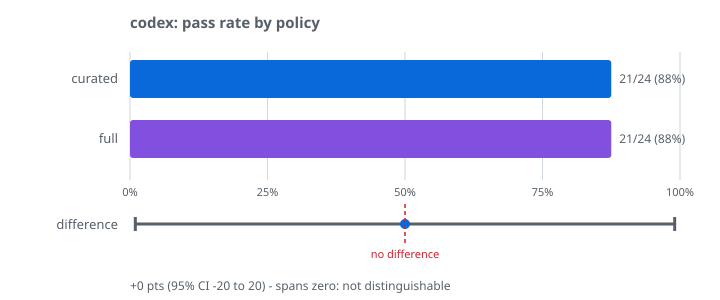
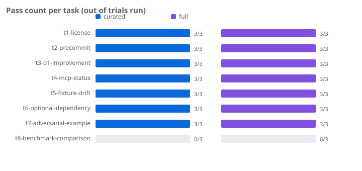

# Run: 2026-08-29 — Codex CLI, sandbox permission (NOT tool count)

**Read the title carefully.** This run does not test claim 001. It was
launched with an earlier version of `profiles/codex.json` that mapped the
policy axis to Codex's sandbox levels:

| policy | what it actually was |
|---|---|
| `curated` | `--sandbox read-only` |
| `full` | `--sandbox workspace-write` |

That varies **write permission**, not **how many tools the model sees** — the
same tool surface is present in both arms. Claim 001 is about tool count, so
this is evidence about a different variable and is kept under its own name
rather than folded into the claim-001 results. The profile has since been
corrected to use `--ignore-user-config` as its policy axis.

Credit: this error was caught by an independent Codex review of the repo, not
by the author.

## Setup

| | |
|---|---|
| Agent | `codex` (Codex CLI 0.147.0, authenticated via ChatGPT) |
| Task set | `examples/claim-001-tool-count` — 8 repo-comprehension questions |
| Corpus | [`pawankumar94/nocontext`](https://github.com/pawankumar94/nocontext) at `6f0d6f48` |
| Trials | 3 per task per policy — 48 invocations |

## Result

| policy | pass rate |
|---|---|
| `read-only` | 21/24 (88%) |
| `workspace-write` | 21/24 (88%) |

**Difference: 0 points (95% CI −20 to +20).** Identical pass rates. On
read-only comprehension tasks, sandbox write permission made no measurable
difference — which is the unsurprising direction, since none of these tasks
requires writing anything. It is a useful negative control: it shows the
harness does not manufacture a difference where none should exist.

## Reading this honestly

- **n=24 per arm.** Only large effects are detectable. "Not distinguishable"
  means underpowered, not equivalent.
- **A null on a negative control is expected**, not a finding. Do not cite this
  as evidence that permissions never matter — these tasks were chosen to be
  answerable read-only.
- **Same scorer limitation as every other run here.** Both arms lost the same
  tasks to phrasing mismatches rather than wrong answers, so the absolute 88%
  understates real accuracy. Because both arms are penalised identically, the
  comparison itself stands.

## Reproducing

The corrected profile no longer runs this comparison. To reproduce it exactly,
set `policyArgs` to `{"curated": ["--sandbox","read-only"], "full":
["--sandbox","workspace-write"]}` and drop `--sandbox` from `extraArgs`.
