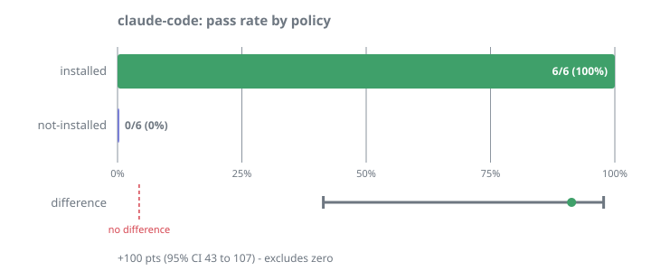

# M2 — capture rate

Does an agent write a ticket when you state a constraint, or does the sentence
still die in the transcript? This is the input path: if nothing gets pinned,
nothing downstream matters.

## Result

Claude Sonnet 4.6 via Vertex, two tasks, three trials per arm, 12 invocations,
zero harness errors.

| Arm | Constraint pinned |
|---|---|
| `installed` — the `AGENTS.md` block `diedinchat install` writes | **6/6 (100%)** |
| `not-installed` — same repo, no convention | **0/6 (0%)** |

**+100 percentage points, 95% Agresti-Caffo interval +43 to +107.** The interval
excludes zero.

<p align="center">
  
</p>

Both tasks separated perfectly, including the harder one where the constraint is
buried inside an unrelated request rather than announced:

> "Add a health check handler at `src/routes/health.ts` that returns `"ok"`.
> While you're here: `src/config.ts` is generated from `src/config.schema.ts` on
> every build, so it must never be edited directly."

A ticket written unprompted in that run:

```json
{
  "text": "src/config.ts is generated from src/config.schema.ts on every build and must never be edited directly.",
  "files": ["src/config.ts", "src/config.schema.ts"],
  "evidence": ["AUTO-GENERATED", "ConfigSchema"],
  "status": "supported"
}
```

It identified the constraint, scoped it to both relevant paths, and chose stable
anchors — the marker comment in the generated file and the interface name in the
schema.

## Why this measures something model capability does not fix

[M1](honor-rate.md) found no effect for constraints an agent can infer from
surrounding code, and a better model would only widen that null. Capture is a
different kind of gap: however capable the model, the sentence still leaves with
the session. Writing it somewhere the next session will look is a property of
the substrate, not of the reasoning.

## A defect this run found, and the fix

The first pass captured 6/6 — and **every one of those tickets had no frozen
evidence.** The template said to pin; it never said to freeze anything.

That put every agent-created ticket in the mode [M0](stale-noise.md) measured at
**65% false alarm**, where the only available signal is `stale` on any edit.
Neither experiment finds this alone: M0 knew evidence-free tickets are noisy but
not that agents produce them; M2 knew agents pin but not that the tickets were
defective.

`templates/diedinchat.md` now teaches `--evidence` with the measured reason.
Re-running the installed arm:

| | Tickets with evidence | Resulting status |
|---|---|---|
| Before | 0/6 | all `open` — nothing to verify against |
| After | **6/6** | all `supported` — self-checking |

Capture rate stayed at 6/6, so the added instruction did not trade pinning for
evidence.

## Frozen design

- Agent: Claude Sonnet 4.6 via Vertex AI (`claude-sonnet-5` returns 429 on this
  project, which is why the model is pinned in the profile)
- Arms differ only in whether the fixture carries the installed `AGENTS.md`
  block. Identical prompts, identical flags, fresh workspace per invocation.
- Scored on the **ticket store**, never on prose. An agent replying "noted, I'll
  remember that" scores `VIOLATED`. The fixture ships no `.diedinchat/`, so any
  ticket present came from that run.
- Keys frozen before the run. One correction was made *before* any scored run:
  the `timeout` keyword was changed to the stem form `timeout*` after a
  discrimination probe showed word-boundary matching rejected a ticket whose
  text said "timeouts".

Fixture and task set: [`examples/pin-capture/`](../../examples/pin-capture/).
Compact records: [`capture-rate-results.json`](capture-rate-results.json).

## Limits

- **One agent, one model.** Copilot, Gemini, Cursor and cheaper tiers are
  untested, and capture is exactly where a weaker instruction-follower would be
  expected to differ.
- **Two tasks.** Both use constraints that cannot be inferred from the code. A
  constraint the model considers obvious may not be judged worth pinning.
- **`diedinchat` had to be on `PATH`.** Without a global install or `npx`, the
  agent cannot pin at all — the 0% arm would also be the result for an installed
  user with no CLI available.
- **Capture is not honor.** This shows the ticket gets written, not that a later
  session obeys it. That is [M1](honor-rate.md), which is still open for
  non-inferable constraints.
