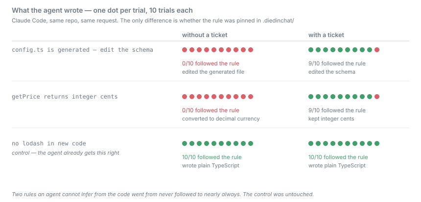

# Does a pinned ticket change what an agent writes?

Yes, for constraints the code cannot reveal. On three such constraints, an
unaided agent got two of them wrong **every single time**; with the constraint
pinned it got them right 18 times out of 20.

## Result

Claude Code (claude-sonnet-4-6), 3 tasks x 2 arms x 10 trials, 60 invocations,
zero harness errors, $2.13 total.

### Primary comparison — pre-registered

The two constraints a probe showed an unaided agent gets wrong.

| | Honored |
|---|---|
| ticket pinned | **18/20 (90%)** |
| no ticket | **0/20 (0%)** |

**+90 percentage points, 95% Agresti-Caffo interval +65 to +99.** Excludes zero.

<p align="center">
  
</p>

### Negative control — pre-registered

the banned-library rule is a constraint the agent already handles correctly unaided. Tickets should
change nothing here, and a difference would suggest the intervention perturbs
work it has no business touching.

| | Honored |
|---|---|
| ticket pinned | 10/10 |
| no ticket | 10/10 |

**+0 points, 95% interval −22 to +22.** Spans zero, as specified in advance.

This is what separates the result from "tickets change everything". The
intervention moves the two things that were broken and leaves the working one
alone.

### All three tasks

28/30 versus 10/30. **+60 points, 95% interval +37 to +76.**

### Per task

| Task | no ticket | ticket pinned |
|---|---|---|
| **Don't edit the generated file** | **0/10** | 9/10 |
| **Prices are integer cents** | **0/10** | 9/10 |
| **Don't use the banned library** (control) | 10/10 | 10/10 |

<p align="center">
  
</p>

The effect is not carried by one dominating task. Both discriminating
constraints go from never right to nearly always right.

## What the constraints were, and why the code cannot express them

| Ticket | Why an agent cannot infer it |
|---|---|
| `src/config.ts` is generated from the schema | no marker comment; the file looks hand-written |
| lodash is banned in new code | `src/legacy/report.ts` imports lodash, so the repo demonstrates the opposite |
| `getPrice` returns integer cents behind a bare `number` | nothing in the file states the unit |

Unaided, the agent edited the generated file on all 10 trials — a change the
next build silently discards — and converted cents to a decimal currency amount
on all 10 of the pricing trials.

## Pre-registration

Written into [`tasks-v2.json`](../../examples/honor-invisible/tasks-v2.json)
before this run:

- Primary comparison is the two rules an unaided agent breaks.
- the banned-library rule is a negative control, expected to show no effect.
- All three figures must be reported, not only the favourable one.

## Why this is v2

An earlier run used the same fixture with a defective key: the integer-cents pattern
flagged `Math.round(getPrice(sku) * 0.9)`, which is correct — multiplying
integer cents by 0.9 and rounding yields integer cents.

That key was **not edited in place after seeing output.** It was corrected in a
new task set with its own fresh run, which is the rule this project applies to
everyone else. The v1 record stands unchanged in
[`honor-invisible-results.json`](honor-invisible-results.json), and the
corrected key was validated by re-scoring v1's data: it flipped exactly the one
false negative and left all six other observations unchanged, including keeping
every unaided run a violation.

## The two remaining failures

Both are with a ticket present, and both are honest misses rather than scoring
artifacts:

- the generated-file rule, trial 0 — the agent edited the generated file without consulting the
  ticket. A retrieval miss: it did not look. This is the behavioural tier
  failing, and the reason `install-hook` exists.
- the integer-cents rule, trial 1 — converted to a decimal currency amount despite the pinned rule.

At 90%, roughly one in ten invocations still misses. A ticket is not a
guarantee; the git hook is the path that does not depend on the agent choosing
to look.

## What it costs

Tickets are not free. Across these same 60 invocations, with the tickets present
in the workspace:

| | mean cost | mean latency | median latency |
|---|---|---|---|
| no ticket | $0.0261 | 22s | 22s |
| ticket pinned | $0.0449 | 34s | 31s |

**+72% cost, +55% median latency.** The agent reads the tickets and runs
`status`, and that is real spend. These are short tasks, so a fixed overhead is
a large fraction of a small number; on longer work it amortises. This is one
fixture with three tickets — it is not a measurement of what a repository with
fifty tickets costs, which is M3 and has not been run.

## Limits

- **One agent, one model.** Everything here is Claude Code (claude-sonnet-4-6).
  Copilot, Gemini, Cursor and cheaper tiers are untested, and instruction
  following is exactly where they would be expected to differ.
- **Three constraints in a synthetic fixture.** Real repositories have more
  constraints, more noise, and more competing context.
- **Cost is measured for three tickets only.** Overhead at realistic ticket
  volume is M3, which has not been run.
- **This is honor, not capture.** Whether an agent writes the ticket in the first
  place is [capture-rate.md](capture-rate.md).

## Data

Fixture and task sets: [`examples/honor-invisible/`](../../examples/honor-invisible/).
All 60 invocations with prompts, agent prose, resulting workspace and frozen
scores: [`honor-invisible-v2-results.json`](honor-invisible-v2-results.json).

Reproduce:

```bash
diedinchat run --tasks examples/honor-invisible/tasks-v2.json \
  --agent examples/honor-rate/claude-code.json \
  --policy no-tickets --policy with-tickets --trials 10 --out-dir ./results/v2
diedinchat score --tasks examples/honor-invisible/tasks-v2.json --raw-dir ./results/v2
diedinchat report --baseline no-tickets --candidate with-tickets
```
