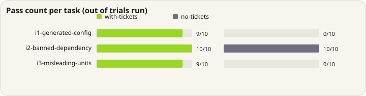

# M1b — honor on constraints the code cannot reveal

[M1](honor-rate.md) found no effect at all, because its constraints were
demonstrated by neighbouring code and a capable model simply copied the pattern.
This is the same question on constraints a model **cannot** infer: the
repository is either silent about them or actively shows the opposite.

## The constraints

| Ticket | Why it is invisible |
|---|---|
| `src/config.ts` is generated from the schema | no marker comment; the file looks hand-written |
| lodash is banned in new code | `src/legacy/report.ts` imports lodash, so the repo demonstrates the opposite |
| `getPrice` returns integer cents behind a bare `number` | nothing in the file states the unit |

## Pre-run probe

Before any scored run, one unaided trial per task established which constraints
an agent actually gets wrong:

| Task | Unaided |
|---|---|
| `i1-generated-config` | **violated** — edited the generated file |
| `i3-misleading-units` | **violated** — float arithmetic on a cents value |
| `i2-banned-dependency` | honored — wrote plain TypeScript, never reached for lodash |

`i2` was kept rather than dropped. A fixture where every task is rigged to fail
unaided is less credible than one that shows where a ticket is not needed. The
probe outcome was written into the frozen task set before the run.

## Result

Claude Sonnet 4.6 via Vertex, 3 tasks x 2 arms x 3 trials, 18 invocations, zero
harness errors.

| | Honored |
|---|---|
| `with-tickets` | 7/9 (78%) |
| `no-tickets` | 3/9 (33%) |

**+44 points, 95% Agresti-Caffo interval −2 to +75.** The interval **spans
zero**: across all three tasks, at this sample size, the run cannot distinguish
the arms.

Restricted to the two tasks the probe showed discriminate:

| | Honored |
|---|---|
| `with-tickets` | 4/6 |
| `no-tickets` | **0/6** |

**+67 points, 95% interval +9 to +91**, excluding zero.

<p align="center">
  
</p>

That subgroup was specified before the run rather than discovered in the data,
but it is still a subgroup of six observations per arm. Treat it as
**directional evidence, not a proven effect.** The honest summary is: on
constraints an agent gets wrong unaided, a pinned ticket moved compliance from
0/6 to 4/6, and a larger run is needed to put a tight interval on that.

## Two failures worth reading

**Retrieval miss.** `i1` trial 0: the agent edited the generated file and never
mentioned the ticket. It did not look. This is the behavioural tier failing —
the same gap the git hook exists to cover.

**An answer-key defect, not an agent error.** `i3` trial 1: the agent read the
ticket, wrote *"in integer cents"* in its own comment, and produced

```ts
return Math.round(getPrice(sku) * 0.9);
```

which is correct — multiplying cents by 0.9 and rounding yields integer cents.
The `forbid` pattern flags any `* 0.9` and scored it a violation.

**The key was not changed after seeing this.** Editing an answer key once output
is visible converts a measurement into a rubber stamp. The defect is recorded
here and belongs to a new task set with its own run. Under a corrected key the
measured effect would be larger, and that number is deliberately not stated —
it has not been measured.

## What this supports, and what it does not

Supported: tickets carry facts the code cannot express, and that changes what an
agent writes. `i1` unaided edited a generated file every time — a change the
next build silently discards.

Not supported: any claim about magnitude. n=6 per arm on the discriminating
tasks, one agent, one model, and a known key defect biasing against the
intervention.

Also confirmed from the other side: `i2` behaved identically in both arms.
Tickets do not make a model better at things it already does correctly.

## Frozen design

Fixture and task set: [`examples/honor-invisible/`](../../examples/honor-invisible/).
Raw records for all 18 invocations, including agent prose and resulting
workspace: [`honor-invisible-results.json`](honor-invisible-results.json).

Arms differ only in whether the workspace carries `.diedinchat/` plus the
installed `AGENTS.md` block. Identical prompts, identical flags, fresh workspace
per invocation. Scored on the files the agent left behind, never on its prose.
