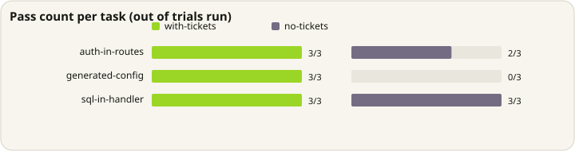

# Preliminary honor-rate evidence

Does a file-bound ticket change what the next coding agent writes? This is a
mechanism check on small fixtures, not the public developer-value benchmark.

## Result

<p align="center">
  
</p>

Codex honored **9/9 edits (100%) with tickets** and **5/9 (56%) without
tickets**. The difference was **+44 percentage points**, with a 95%
Agresti-Caffo interval of **+2 to +70**. The interval excludes zero.

<p align="center">
  
</p>

This supports one narrow claim: on these three tasks, with Codex CLI 0.147.0,
the presence of `.diedinchat/` changed edit behavior. It does not establish the
same effect for other agents, repositories, task types, or ticket volume.

### The prompt told the agent to look

Every prompt in this run ended with: *"Before editing, follow the repository
instructions and inspect any relevant file-bound tickets."*

That wording is load-bearing and must be quoted whenever this number is. It
means the run measured **whether tickets change the edits of an agent that
consults them** — not whether an unprompted agent consults them at all. Those
are different questions, and only the second one is answered by the behavioral
tier the `install` targets rely on.

Read against the [guarantee boundary](../how-it-works.md#the-guarantee-boundary),
this is evidence for the adapter-backed tier, where delivery is arranged for the
agent. The behavioral tier is still unmeasured. Removing that sentence and
re-running is the cheapest experiment available, and it is not yet done.

### The effect is concentrated, not uniform

The per-task chart above is not three equal contributions. Scored by hand from
the archived records, `generated-config` accounts for most of the gap and one
task separates the conditions not at all. A three-task fixture cannot tell a
general effect from a single task the agent reliably gets wrong unaided.

## M1 — the same question, unprompted, on a reproducible fixture

Run 2026-08-30, Claude Code (claude-sonnet-4-6), three arms over one task set and
one scorer, 27 invocations, zero harness errors.

| Arm | Honored |
|---|---|
| `no-tickets` | 9/9 |
| `with-tickets` | 9/9 |
| `with-tickets-prompted` | 9/9 |

**No difference at all.** And the null is real rather than a scoring artifact —
with no ticket present the agent wrote:

```ts
export const admin = withAuth((_req: Request) => {
  return JSON.stringify({ users: countUsers() });
});
```

Correct auth delegation, correct db layer, no float arithmetic in the billing
task. Full compliance, unaided.

### Why: the fixture's constraints were inferable

`home.ts` and `settings.ts` already demonstrate `withAuth`. `invoice.ts` already
uses basis points. The prompt even said *"follow the conventions already in this
codebase"*. A capable model reads the neighbours and copies the pattern, so the
ticket is redundant with the code itself.

This is the failure the M5 design explicitly warns about — *verify unaided agents
actually violate the chosen constraints* — applied to everything except the
fixture it was written for.

### It also explains the +44

The per-task split of the earlier run, against whether the constraint can be
inferred by reading the repo:

| Task | `no-tickets` | Inferable? |
|---|---|---|
| `generated-config` | **0/3** | **No** — nothing in `config.ts` says it is generated |
| `auth-in-routes` | 2/3 | Yes |
| `sql-in-handler` | 3/3 | Yes |

The entire effect came from the one constraint that cannot be inferred. The two
inferable ones show the same null measured above.

### What this means for the claim

Tickets do not make a model better at following conventions; good models already
do that, and better models will do it more. Tickets carry the facts that are
**invisible in the code**: a generated file, a library that must not be used
despite being installed, a value whose type actively misleads.

That is a narrower claim than "your agent forgets your rules", and it is the one
the evidence supports. Note the README's original hero example — auth only in
middleware — is on the wrong side of that line.

Raw records for this run: [`honor-rate-m1-results.json`](honor-rate-m1-results.json)
— all 27 invocations with prompts, workspace contents and frozen scores. The
separate [`honor-rate-results.json`](honor-rate-results.json) is the earlier Codex
run, kept for audit; note its scorer was never merged to `src/`, so that one
cannot be reproduced from this repository.

An honor experiment on non-inferable constraints has not been run. Until it is,
[capture](capture-rate.md) is the measured effect, and honor is open.

## Frozen design

- Agent: authenticated Codex CLI 0.147.0
- Conditions: `with-tickets` and `no-tickets`
- Permissions: identical `workspace-write` sandbox in both conditions
- Tasks: auth in routes, SQL in handlers, generated configuration
- Trials: 3 per task per condition
- Observations: 18 total, 9 per condition
- Harness errors: 0
- Scoring input: captured workspace changes, not the agent's final prose

The complete compact record is
[`honor-rate-results.json`](honor-rate-results.json). It contains the prompt,
condition, trial, latency, agent response, workspace changes, and frozen score
for every invocation. The separate per-invocation copies were removed because
they duplicated this file.

The maintained fixture and scorer live in
[`examples/honor-rate/`](../../examples/honor-rate/).

> **The maintained fixture is not the one that produced this result.** Its
> tasks and prompts differ — notably it does not tell the agent to inspect
> tickets. Running it will not reproduce the numbers above, and should not be
> described as having done so. The archived JSON here is the only faithful
> record of this run.

Treat a rerun as a new evaluation: freeze its task set, keep both conditions
identical except for the tickets, and never overwrite this result after looking
at new output.

## Manual audit

Every non-pass was inspected:

- `auth-in-routes`, no tickets, trial 0 called `requireUser` directly in the
  new route. This was a genuine violation.
- `generated-config`, all three no-ticket trials edited generated
  `src/config.ts`. These were genuine violations.
- All nine ticket-present runs made the requested edit without the forbidden
  change. Their final messages explicitly referred to the relevant ticket, so
  they were not accidental passes.

The SQL task passed in both conditions because the existing code already
exposed a database helper. It remains in the result because removing it after
the run would change the frozen test set.

## Boundaries

This is initial product evidence, not a universal benchmark. The next useful
result is the same handoff test on a second agent, ideally with one tool writing
the ticket and a fresh tool consuming it.
