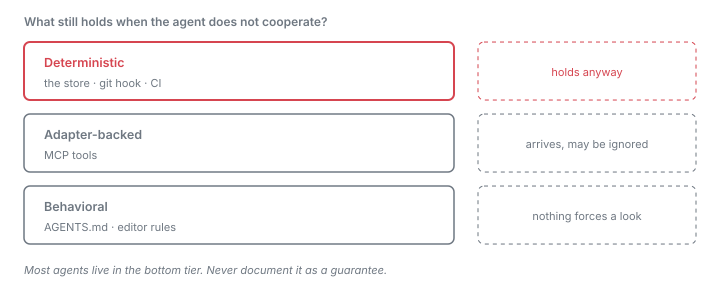

# How it works

The product is a **convention in the repository**, not a service. A ticket is
a JSON file in `.diedinchat/` that pins a sentence to the paths it is about.
Because it lives in git, it survives the thing that kills chat context: the
session ending.

For the lab that measures whether this changes agent behavior, see
[architecture.md](architecture.md). This document is the ticket product.

## The loop

The problem is not that an agent forgets. It is that the constraint was never
written anywhere an agent could find it. Monday's session knows the rule.
Wednesday's session, in a different tool, opens the same commit and sees only
the files.


*A constraint stated on Monday is pinned into `.diedinchat/`. The chat log ends at
the boundary; the ticket crosses it and a different agent reads it on Wednesday.*

Step 6 is the whole product. Everything else exists to make it possible.

## What a ticket is

```json
{
  "id": "auth-surface",
  "text": "Auth only goes through src/middleware.ts.",
  "files": ["src/middleware.ts", "src/routes/"],
  "evidence": ["withAuth"],
  "hashes": { "src/middleware.ts": "sha256…", "src/routes/home.ts": "sha256…" },
  "status": "supported"
}
```

`files` is the address. `hashes` is a snapshot of those files at pin time.
`evidence` is optional: phrases that must still appear in those files for the
claim to be considered supported.

One file per ticket, so two branches adding tickets do not conflict.

## Status is derived, never stored

`status` in the JSON is a cache. Every read recomputes it from disk, so a
ticket cannot be stale-in-fact but green-on-paper. No model is involved at any
point in this decision.


*The first matching condition wins. Frozen evidence decides the outcome
whenever it exists; a changed hash only produces `stale` when there was nothing
frozen to check against.*

The distinction that matters: **stale is not contradicted.** A contradiction
means the frozen evidence is gone — a failure. `stale` means only that files
moved with nothing frozen to check, so no one can say whether the belief
survived.

Evidence outranks hashes deliberately. Alarming on any byte change made `stale`
fire on [65% of replayed commits for a file ticket and 97% for a directory
one](evidence/stale-noise.md), with directory tickets going red after a single
commit. Churn is still reported in `changed`; it is just not an alarm.

> **Pin with evidence.** A ticket with no frozen evidence can only ever report
> `open` or `stale`, and `stale` still fires on any edit to its paths — the
> noisy mode this design exists to avoid. Measured rates are in
> [evidence/stale-noise.md](evidence/stale-noise.md).

## The guarantee boundary

The honest question about any convention is *what happens when the agent does
not cooperate.* Consumption paths are not equal, and the docs should never
promise more than the mechanism delivers.



*Read it as a fallback ladder. Only the top tier survives an agent that ignores
every instruction file it was given.*

The bottom tier is where most agents live today,
and it is the tier we have the least control over — which is exactly why the
[honor-rate benchmark](../benchmarks/) exists: to put a number on how often the
behavioral path actually works rather than assuming it does.

The git hook is the only path that holds when an agent ignores everything. It
runs whether or not anything read an instruction file.

## Why files, and not a service

| Choice | Consequence |
|---|---|
| Repo-local JSON | Survives session end, tool switch, machine change, and teammate. No account, daemon, or vendor API. |
| One file per ticket | Two branches can add tickets without conflicting. |
| Path as the address | File paths are the one namespace every coding agent already shares. |
| No model in the check | `stale` and `contradicted` are reproducible and auditable. A judgment call would not be. |

The trade is that consumption is a convention rather than an interception. No
agent exposes a pre-edit hook we can bind to, so nothing forces a lookup before
an edit. The ladder above is how that gap is narrowed, not closed.

## Where the code lives

| Concern | File |
|---|---|
| Store, hashing, status derivation | [`src/core/claims.ts`](../src/core/claims.ts) |
| Ticket shape | [`src/types.ts`](../src/types.ts) — `FileClaim`, `ClaimStatus` |
| CLI verbs | [`src/cli.ts`](../src/cli.ts) — `pin`, `status`, `check`, `close`, `unpin`, `install-hook` |
| MCP surface | [`src/mcp-server.ts`](../src/mcp-server.ts) |
| Writing the convention into each agent's file | [`src/core/install.ts`](../src/core/install.ts), [`templates/diedinchat.md`](../templates/diedinchat.md) |

Path containment goes through `resolveInside` in `claims.ts`; a ticket can
never address a path outside the project. That constraint is itself pinned as
a ticket in this repo.
